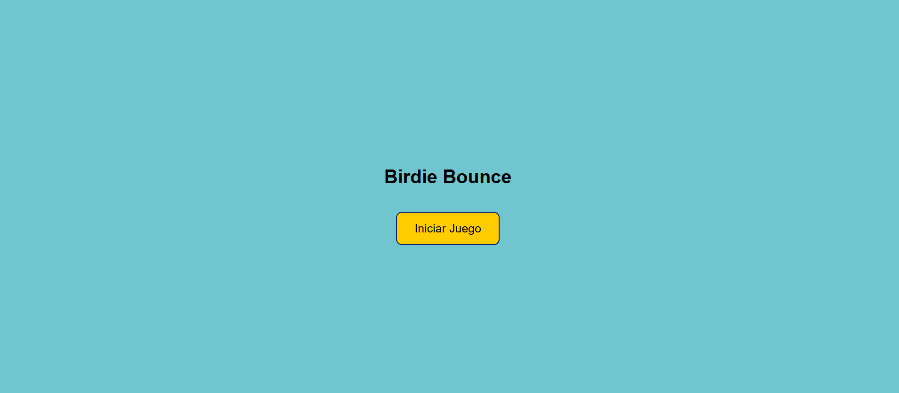

# Mini Juego: Birdie Bounce 🎮

_Birdie Bounce_ es un minijuego inspirado en el estilo de _Flappy Bird_, desarrollado completamente en **HTML**, **CSS**, y **JavaScript**.

## Descripción del Juego

En _Birdie Bounce_, controlas a un pequeño pájaro que debe sortear obstáculos mientras se mantiene en el aire. Cada vez que superas un obstáculo, sumas puntos. El objetivo es llegar lo más lejos posible sin chocar.

- **Control del personaje**: Haz clic o presiona para que Birdie dé un pequeño salto y así esquive los obstáculos.
- **Desafío creciente**: La velocidad de los obstáculos aumenta progresivamente, poniendo a prueba tu habilidad y reflejos.

## Cómo Jugar

1. **Inicia el juego** presionando el botón de inicio en la pantalla de bienvenida.
2. **Controla a Birdie** presionando cualquier tecla o haciendo clic para mantenerlo volando.
3. **Evita los obstáculos** para continuar sumando puntos y alcanzar una nueva puntuación máxima.

## Capturas de Pantalla

### Pantalla de Inicio

### Pantalla de Juego

## Tecnologías Utilizadas

- **HTML**: Estructura del juego.
- **CSS**: Estilizado del entorno de juego y diseño responsive.
- **JavaScript**: Lógica del juego, detección de colisiones y control de movimientos.

---

¡Anímate a jugar _Birdie Bounce_ y demuestra cuántos obstáculos puedes superar sin chocar! 🐦
